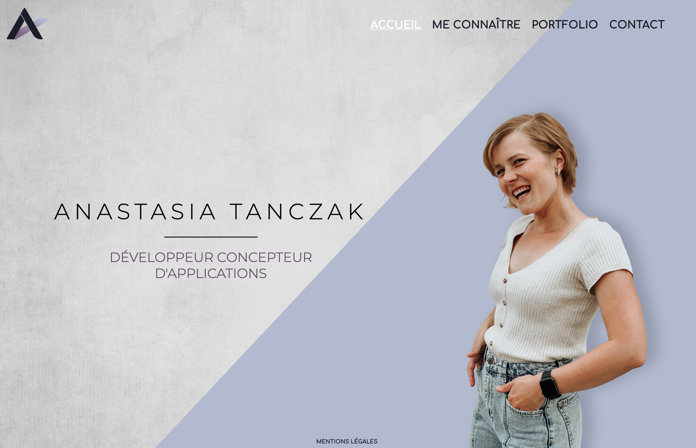
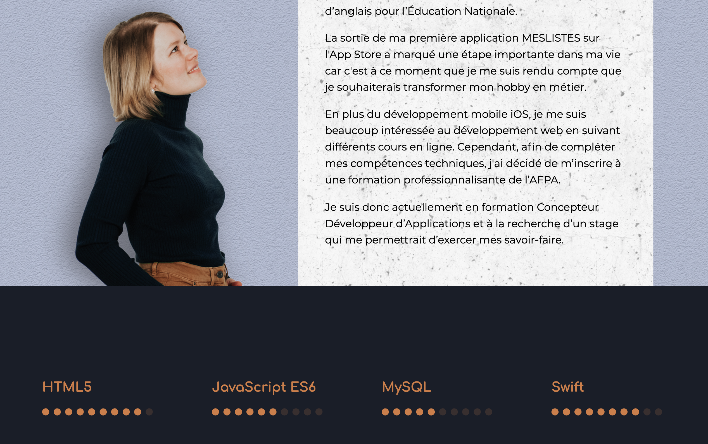
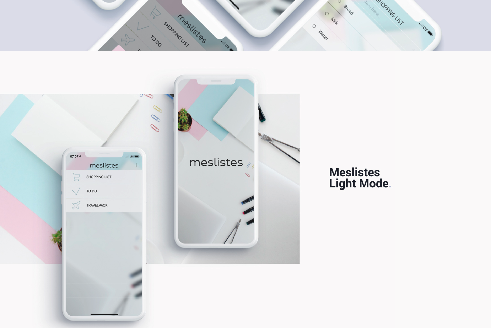

# Mon ancien site portfolio

**Description :**
L’ancienne version de mon site portfolio, créée au début de ma formation Concepteur Développeur d’Applications n’est plus active. Elle est remplacée par une nouvelle version complètement repensée, conçue avec d’autres technologies et un autre design.

**Technologies utilisées :**
HTML, CSS, PHP

**Page d'accueil :**

**Page me conaître :**

**Page portfolio :**

**Page contact :**

